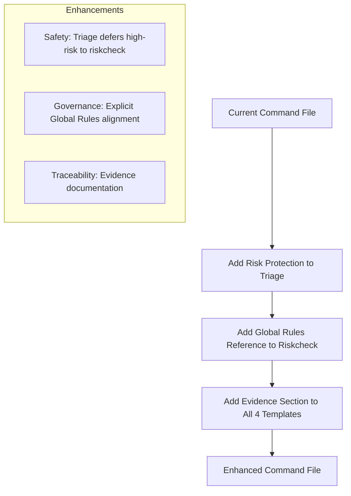
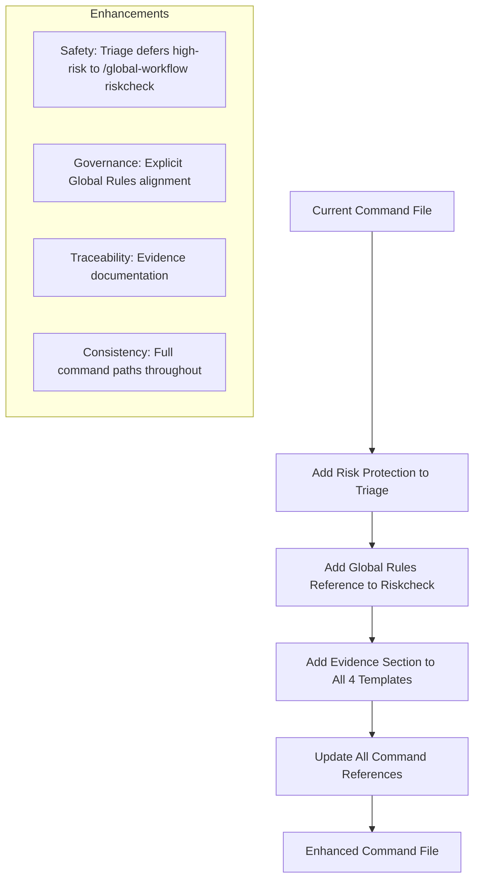

# Enhance Global Workflow Command

## Three Enhancements to Implement

### 1. Triage Safety Enhancement

Add risk protection to prevent premature planning of high-risk requests.

**Location**: [`C:\Users\YH\.cursor\commands\global-workflow.md`](C:\Users\YH\.cursor\commands\global-workflow.md) lines 19-28 (triage Workflow section)

**Change**: Replace the entire Workflow section (lines 19-28) with:

```
**Workflow**:
1. Analyze the user's request for clarity and completeness
2. If the request implies production impact or destructive actions, do not propose a plan; defer to `/global-workflow riskcheck`
3. If request is clear and unambiguous (and low-risk):
   - Propose the safest, most conservative plan immediately
   - Prefer reversible over irreversible actions
   - Prefer additive over destructive changes
4. If request is ambiguous or missing critical context:
   - Ask 1-2 critical clarifying questions only
   - Do not ask obvious or unnecessary questions
   - Focus on: scope, environment, constraints, expected outcome
```

**Note**: Use the full command path `/global-workflow riskcheck` (not just `/riskcheck`) to avoid ambiguity.

### 2. Riskcheck Governance Enhancement

Add explicit reference to Global Rules alignment.

**Location**: [`C:\Users\YH\.cursor\commands\global-workflow.md`](C:\Users\YH\.cursor\commands\global-workflow.md) lines 53-60 (riskcheck Workflow section)

**Change**: Replace the Workflow section (lines 53-60) with:

```
**Workflow**:
1. Analyze the proposed change for risk categories:
   - **Security**: Auth, permissions, secrets, injection, XSS
   - **Compliance**: Audit trails, data retention, PII handling
   - **Production**: Live system impact, downtime, data loss
   - **Data**: Schema changes, migrations, bulk updates
2. Check against CAB governance rules (user rules)
3. Approvals must align with Global Rules (CAB, Production Safety, Data Protection)
4. Determine required approvals
```

**Note**: Step 3 explicitly connects riskcheck to your Global Rules for governance alignment.

### 3. Evidence-Based Enhancement

Add "Evidence Referenced" section to all four output templates.

**Locations and Changes**:

#### triage Output Template (lines 31-45)

Add after line 44:

```
- Reversible: Yes / No

**Evidence Referenced**:
- [files/commands/tests that support the conclusions]
```

#### riskcheck Output Template (lines 71-97)

Add after line 96:

```
- [How to revert if something goes wrong]

**Evidence Referenced**:
- [files/commands/tests that support the conclusions]
```

#### handoff Output Template (lines 113-144)

Add after line 143:

```
- [Any unresolved items requiring human decision]

**Evidence Referenced**:
- [files/commands/tests that support the conclusions]
```

#### review Output Template (lines 169-204)

Add after line 203:

```
[1-2 sentence summary of review findings]

**Evidence Referenced**:
- [files/commands/tests that support the conclusions]
```

## Implementation Flow



## Benefits

| Enhancement | Benefit |

|-------------|---------|

| Triage Risk Protection | Prevents premature planning of destructive/production changes |

| Global Rules Reference | Creates explicit governance alignment and compliance |

| Evidence Documentation | Ensures audit trail and accountability for all workflow stages |

### 4. Command Path Consistency

Ensure all references to riskcheck use the full command path.

**Location**: Entire file - search for any instances of `/riskcheck` or `defer to /riskcheck`

**Change**: Replace all instances with `/global-workflow riskcheck`

**Rationale**: Prevents ambiguity and ensures correct command invocation. The agent should always use the full command path when deferring to another sub-command.

## Implementation Flow



## Benefits

| Enhancement | Benefit |

|-------------|---------|

| Triage Risk Protection | Prevents premature planning of destructive/production changes |

| Global Rules Reference | Creates explicit governance alignment and compliance |

| Evidence Documentation | Ensures audit trail and accountability for all workflow stages |

| Command Path Consistency | Prevents ambiguity and ensures correct command invocation |

## Verification

After implementation:

- [ ] Triage workflow includes risk check before planning with full command path
- [ ] Riskcheck explicitly references Global Rules
- [ ] All four output templates end with "Evidence Referenced"
- [ ] All references to riskcheck use `/global-workflow riskcheck` (not just `/riskcheck`)
- [ ] Command maintains structural integrity and readability