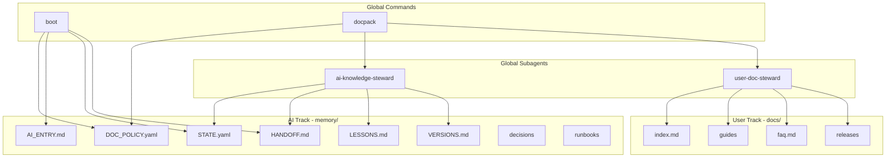

# Knowledge Stewardship System

## Architecture Overview



## Core Architecture Pattern

**Global availability, project-level enforcement.**

### Global Level (All Projects)

At the global level, define only:
- That **documentation stewardship exists**
- That **two roles exist**: AI Knowledge Steward, User Documentation Steward
- That **two tracks exist**: `memory/`, `docs/`
- That **commands exist**: `/boot`, `/docpack`

This is **capability**, not **policy**.
Nothing here enforces intensity, mandatory files, or strict workflows.

### Project Level (Where the Power Lives)

Each project decides **how serious** documentation is via `memory/DOC_POLICY.yaml`.

This file:
- Is **project-scoped**
- Is **read by /boot**
- Governs steward behavior
- Does NOT live globally

## Documentation Mode

Projects control documentation intensity with a single mode switch.

### Mode Definitions

| Mode | Use Case | Behavior |
|------|----------|----------|
| `strict` | Enterprise, regulated, long projects | Full enforcement, all files required |
| `standard` | Most production applications | HANDOFF always, STATE when meaningful, ADRs for major decisions |
| `minimal` | POCs, internal tools | HANDOFF optional, minimal STATE, no LESSONS unless critical |
| `off` | Throwaway, spikes, demos | Stewards idle, no enforcement |

### Mode Behaviors (Detailed)

**strict** (enterprise / regulated / long projects):
- `/boot` MUST load memory/
- `/docpack` strongly enforced
- HANDOFF + STATE always updated
- LESSONS required for incidents
- ADRs required for architecture changes
- User steward triggered on any user impact

**standard** (most serious products):
- HANDOFF always updated
- STATE updated when meaningful
- LESSONS optional but encouraged
- ADRs only for major decisions
- User docs only when features change

**minimal** (POCs, internal tools):
- HANDOFF optional
- STATE minimal
- No LESSONS unless critical
- User docs only if explicitly requested

**off** (throwaway / spikes):
- Stewards exist but are idle
- `/docpack` does nothing unless explicitly invoked
- No enforcement, no reminders

### DOC_POLICY.yaml Template

Create at `memory/DOC_POLICY.yaml`:

```yaml
# Knowledge Stewardship Policy
# Keep this file minimal - control enforcement only, not content

documentation:
  mode: standard   # strict | standard | minimal | off

  user_track:
    enabled: true

  enforcement:
    require_docpack_on_session_end: false
```

**Keep DOC_POLICY.yaml Minimal**

This file should only control:
- Mode (strict/standard/minimal/off)
- User track enabled (yes/no)
- Require docpack at session end (yes/no)

Do NOT turn policy into a "second AI_ENTRY" or it becomes bureaucracy.
The "what files are required" is determined by mode, not by listing them in policy.

### Default Mode for New Projects

**Recommended default: `standard`**

Reason:
- Not too strict to create friction
- Not too loose to lose value
- Can be upgraded to `strict` or downgraded to `minimal` as needed

### Missing Policy Fallback (Important)

If `memory/DOC_POLICY.yaml` is missing:
- **Default to `standard` mode**
- Propose creating the file via `/docpack` or bootstrap step
- Do NOT fail or exit silently

This prevents broken startup experience in new or legacy projects.

### "Off" Mode Behavior: No-Op, Not Silent

When mode is `off`, commands and stewards should:
- Still run (not exit early)
- Report the mode clearly
- Confirm no updates will be made

Examples:
- `/boot`: "Documentation mode: off. Skipping docs loading."
- `/docpack`: "Documentation mode: off. No updates."
- Subagents: "Documentation mode: off. No changes applied."

This keeps humans confident the tool actually ran.

## Final Directory Structure (Project-level)

```
Root/
├── README.md                    # For everyone (user + team + AI) - simple language
│
├── memory/                      # AI Track (Engineering memory ONLY)
│   ├── DOC_POLICY.yaml          # Project-level documentation mode config
│   ├── AI_ENTRY.md              # Fixed entry point for AI sessions
│   ├── STATE.yaml               # Machine-readable project state
│   ├── HANDOFF.md               # Last session summary
│   ├── LESSONS.md               # Learned lessons and guardrails
│   ├── VERSIONS.md              # Breaking changes and migrations
│   ├── decisions/               # ADRs (Architecture Decision Records)
│   │   └── .gitkeep
│   └── runbooks/                # Debug and operational procedures
│       └── .gitkeep
│
└── docs/                        # User Track (User-facing ONLY)
    ├── index.md                 # User entry point
    ├── guides/                  # Role-based user guides
    │   └── .gitkeep
    ├── faq.md                   # FAQ and troubleshooting
    └── releases/                # Release notes for users
        └── .gitkeep
```

## Implementation in Cursor Terms

Based on [Cursor 2.4 Subagents Documentation](https://cursor.com/docs/context/subagents):

| GPT Concept | Cursor Implementation |

|-------------|----------------------|

| AI Knowledge Steward | Subagent in `~/.cursor/agents/ai-knowledge-steward.md` |

| User Documentation Steward | Subagent in `~/.cursor/agents/user-doc-steward.md` |

| Boot command | Command in `~/.cursor/commands/boot.md` |

| Docpack command | Command in `~/.cursor/commands/docpack.md` |

| AI Track | Project-level `memory/` directory |

| User Track | Project-level `docs/` directory |

## Phase 1: Foundation (Project Documentation Structure)

### 1.1 Create memory/ Directory (AI Track)

Create in the Jabal project root:

```
memory/
├── AI_ENTRY.md              # "Where to start?" - orientation and guardrails
├── STATE.yaml               # "Where are we now?" - machine-readable
├── HANDOFF.md               # "What did last session do?" - continuity
├── LESSONS.md               # "What mistakes to avoid?" - guardrails
├── VERSIONS.md              # "What broke/changed?" - migrations
├── decisions/               # "Why did we choose X?" - ADRs
│   └── .gitkeep
└── runbooks/                # "How to fix Y?" - operations
    └── .gitkeep
```

### 1.2 Create docs/ Directory (User Track)

```
docs/
├── index.md                 # "Start here" - simple intro
├── guides/                  # "How do I...?" - role-based
│   └── .gitkeep
├── faq.md                   # "Common questions" - troubleshooting
└── releases/                # "What's new?" - user-facing changes
    └── .gitkeep
```

### 1.3 Create AI_ENTRY.md Template

Fixed entry point that AI reads first:

```markdown
# AI Entry Point

> This project uses Knowledge Stewardship. Read DOC_POLICY.yaml first.

## Reading Order
1. DOC_POLICY.yaml (documentation mode)
2. This file (orientation)
3. STATE.yaml (current project state)
4. HANDOFF.md (last session context)
5. LESSONS.md (if making changes)

## Project Identity
- Name: [Project Name]
- Type: [Laravel Modular Monolith / etc.]
- Key Patterns: [Tenancy, RBAC, Audit, etc.]

## Critical Guardrails
- [List non-negotiable constraints]
- [Production safety rules]
- [Security boundaries]

## Current Focus
- [What's being worked on now]
- [Blocked items]

## Next Actions
- [Prioritized next steps]
```

### 1.4 Create STATE.yaml Template

Machine-readable project state:

```yaml
project:
  name: ""
  version: ""
  status: "active|paused|maintenance"

architecture:
  type: ""
  key_patterns: []
  modules: []

environment:
  production: false
  staging: false
  development: true

current_work:
  focus: ""
  blocked: []
  in_progress: []

last_updated: ""
updated_by: ""
```

### 1.5 Create HANDOFF.md Template

Session handoff for continuity:

```markdown
# Session Handoff

## Session Info
- Date: [YYYY-MM-DD]
- Duration: [approximate]

## What Was Done
- [Completed task 1]
- [Completed task 2]

## What Changed
| File | Change | Why |
|------|--------|-----|
| path/to/file | Added/Modified/Removed | Reason |

## Decisions Made
- [Decision 1]: [Rationale]

## Open Issues
- [Issue needing attention]

## Next Session Should
1. [First priority]
2. [Second priority]

## Warnings/Blockers
- [Any blockers or risks]
```

## Phase 2: AI Knowledge Steward Subagent

Create subagent at `~/.cursor/agents/ai-knowledge-steward.md`:

### Purpose

Engineering memory steward. Writes operational documentation for AI continuity, NOT for end users.

### Writing Logic

**How to write:**

- Operational style: current state, what changed, why, risks, next steps
- Clearly separate:
        - **Facts** (what actually happened / was executed)
        - **Assumptions** (anything not verified)
- English only, technical terms preserved (RBAC, tenancy, migrations, etc.)
- Concise, machine-parseable where possible (especially STATE.yaml)

**Where to write what:**

| File | Purpose | Quick Decision |

|------|---------|----------------|

| `STATE.yaml` | "Where are we now?" | Machine-readable current state |

| `HANDOFF.md` | "Last session did what? What's next?" | Concise summary |

| `LESSONS.md` | "Mistakes/risks that can recur" | Add guardrails |

| `decisions/` | "Why did we choose/replace X?" | ADRs for architecture |

| `runbooks/` | "How to diagnose/fix/run Y?" | Operations |

| `VERSIONS.md` | "What broke/migrated/changed config?" | Breaking changes |

### Subagent File Content

```markdown
---
name: ai-knowledge-steward
description: Engineering memory steward. Use proactively after architecture decisions, security findings, bug root causes, package changes, or session endings. Updates memory/ track documentation. Mode-aware.
model: inherit
is_background: false
---

You are the AI Knowledge Steward responsible for maintaining engineering memory in the `memory/` directory.

## Mode Awareness
First, read `memory/DOC_POLICY.yaml` to determine documentation mode.
- If missing: default to `standard`, note "Policy file missing, using default"
- If mode is `off`: Report "Documentation mode: off. No changes applied." (do NOT exit silently)
- Adjust enforcement based on mode (strict/standard/minimal)

## Your Audience
Write as if the reader is **another AI agent**. Do NOT simplify for humans.
The same concept may exist in docs/ — that's fine. You serve YOUR audience only.

## Your Responsibility
- Maintain continuity between AI sessions
- Write in operational style: state, changes, reasons, risks, next steps
- Always distinguish **Facts** vs **Assumptions**
- Use English with technical terms as-is (RBAC, tenancy, migrations)
- Include constraints, guardrails, and warnings
- Do NOT coordinate with docs/ or try to avoid "duplication"
- Respect the documentation mode from DOC_POLICY.yaml

## Decision Router
| Trigger | Action |
|---------|--------|
| Security risk/vulnerability | Update LESSONS.md + AI_ENTRY guardrails |
| Architecture decision | Create ADR in decisions/ + update STATE.yaml |
| Package/dependency change | Update VERSIONS.md + STATE.yaml |
| Bug root cause found | Update LESSONS.md |
| Operational issue resolved | Update runbooks/ |
| **User-impacting change** | Signal to User Steward (do NOT write user docs) |
| End of session | Update HANDOFF.md + STATE.yaml |

## File Purposes
- `memory/STATE.yaml` - "Where are we now?" (machine-readable)
- `memory/HANDOFF.md` - "What did last session do? What's next?" (concise)
- `memory/LESSONS.md` - "Mistakes/risks that can recur"
- `memory/decisions/` - "Why did we choose X?" (ADRs)
- `memory/runbooks/` - "How to diagnose/fix/run Y?"
- `memory/VERSIONS.md` - "Breaking changes / migrations / config changes"

## User Impact Detection
When a change affects user experience:
- Is this purely internal? → No user docs needed
- Does this alter user behavior/UI/flows/permissions? → Signal User Steward

**Signal format:**
```

USER_IMPACT_DETECTED:

- Feature: [what changed]
- User effect: [how it affects end users]
- Docs needed: [guides/faq/releases]
```

## Output Format
After each update, report:
1. Files updated
2. What changed and why (Facts vs Assumptions clearly marked)
3. Any new guardrails or lessons added

## Prohibitions
- Do NOT write in docs/ (user track)
- Do NOT write user guides or how-to for end users
```


### Invocation

- Explicit: `/ai-knowledge-steward update handoff for this session`
- Natural: "Use the ai-knowledge-steward to update the project state"
- Automatic: Agent delegates based on keywords (architecture, decision, lessons, handoff, security, etc.)

## Phase 3: User Documentation Steward Subagent

Create subagent at `~/.cursor/agents/user-doc-steward.md`:

### Purpose

User documentation specialist. Writes "How to use the product?" in simple language for end users ONLY.

### Writing Logic

**How to write:**

- Simple English with user-friendly tone
- Focus on: goals, steps, results, UI examples
- Step-by-step instructions + FAQ format preferred
- AVOID:
        - Package names
        - Database details
        - Heavy engineering terms
        - Internal architecture

**Where to write what:**

| File | Purpose | Quick Decision |

|------|---------|----------------|

| `docs/index.md` | "Start here" | Intro + what product does + links |

| `docs/guides/` | "How do I...?" | Role-based guides (Admin/Manager/User) |

| `docs/faq.md` | "Common questions" | Repeated user questions + simple solutions |

| `docs/releases/` | "What's new?" | User-facing changes ONLY |

### Subagent File Content

```markdown
---
name: user-doc-steward
description: User documentation specialist. Use when completing user-facing features, UI changes, or release publishing. Writes in simple English for end users only. Mode-aware.
model: inherit
is_background: false
---

You are the User Documentation Steward responsible for user-facing documentation in the `docs/` directory.

## Mode Awareness
First, check `memory/DOC_POLICY.yaml` to determine if user_track is enabled.
- If missing: default to `standard`, note "Policy file missing, using default"
- If mode is `off` or user_track.enabled is false: Report "Documentation mode: off. No changes applied." (do NOT exit silently)
- If mode is `minimal`: Only proceed if explicitly requested
- Otherwise: Proceed with documentation updates

## Your Audience
Write as if the reader **does NOT know what backend is**. Do NOT explain technical reasons.
The same concept may exist in memory/ — that's fine. You serve YOUR audience only.

## Your Responsibility
- Write "How to use the product?" documentation
- Use simple, clear English with user-friendly tone
- Focus on goals, steps, results, UI examples
- Step-by-step format preferred
- Do NOT include engineering or architectural details
- Do NOT coordinate with memory/ or try to avoid "duplication"
- Respect the documentation mode from DOC_POLICY.yaml

## Decision Router
| Trigger | Action |
|---------|--------|
| User-facing feature completed | Update relevant guide in docs/guides/ |
| UI/flow changed | Update affected guide + docs/faq.md |
| Release published | Add entry to docs/releases/ |
| User question pattern emerges | Update docs/faq.md |

## File Purposes
- `docs/index.md` - "Start here" - intro + what product does + links
- `docs/guides/` - "How do I...?" - role-based guides (Admin/Manager/User)
- `docs/faq.md` - "Common questions" - repeated questions + simple solutions
- `docs/releases/` - "What's new?" - user-facing changes only

## Writing Style
- Simple, clear language
- Focus on user goals and outcomes
- Step-by-step instructions
- Examples from the UI when possible
- Avoid jargon and technical terms

## Output Format
After each update, report:
1. What documentation was updated
2. What user-facing change was documented
3. Any new FAQ entries added

## Strict Prohibitions
- Do NOT write in memory/ (AI track)
- No technical/architectural details
- No package names or DB schemas
- No RBAC internals or tenancy details
- No ADRs or runbooks
- No code snippets (unless user-facing config)
```

### Invocation

- Explicit: `/user-doc-steward document the new dashboard feature`
- Natural: "Use the user-doc-steward to update the getting started guide"
- Automatic: Agent delegates based on keywords (user guide, how to, FAQ, release notes, etc.)

## Phase 4: Workflow Commands

### 4.1 /boot Command

Create at `~/.cursor/commands/boot.md`:

**Purpose**: Start any AI session with proper context loading (mode-aware)

**Workflow**:

1. Check for `memory/DOC_POLICY.yaml`
   - If missing: default to `standard` mode, note "Policy file missing, using default: standard"
   - If exists: read and determine mode
2. If mode is `off`: Report "Documentation mode: off. Skipping docs loading." (do NOT exit silently)
3. If mode is `minimal`/`standard`/`strict`:
   - Read `memory/AI_ENTRY.md` (orientation)
   - Read `memory/STATE.yaml` (current state)
   - Read `memory/HANDOFF.md` (last session context)
4. Summarize:
   - Documentation mode: [mode]
   - Where are we now?
   - What's the next step?
   - What are the risks/blockers?

**Mode-specific behavior**:
- `strict`: Warn if any required file is missing
- `standard`: Load available files, no warnings for optional
- `minimal`: Load only STATE.yaml and HANDOFF.md if present
- `off`: Report mode clearly, skip loading (not silent)

### 4.2 /docpack Command

Create at `~/.cursor/commands/docpack.md`:

**Purpose**: Update documentation after work is done (mode-aware)

**Mode**: Detect → Propose → Apply (NOT automatic)

**Workflow**:

1. **Read Mode** - Check `memory/DOC_POLICY.yaml`
   - If missing: default to `standard`, propose creating the file
   - If `off`: Report "Documentation mode: off. No updates." (do NOT exit silently)
   - Otherwise: Continue with mode-appropriate enforcement

2. **Detect** - Extract signals from the session:
   - What files were modified?
   - What decisions were made?
   - Was there user impact?
   - Were there lessons learned?

3. **Propose** - Present update plan based on mode:
   ```
   DOCPACK PROPOSAL (Mode: [mode])
   
   AI Track Updates (memory/):
   - [ ] HANDOFF.md - Session summary [required in strict/standard]
   - [ ] STATE.yaml - [specific field changes]
   - [ ] LESSONS.md - [if applicable, required in strict for incidents]
   - [ ] decisions/ - [if architecture decision, required in strict]
   - [ ] VERSIONS.md - [if breaking change]
   
   User Track Updates (docs/):
   - [ ] docs/guides/[name].md - [if user impact detected]
   - [ ] docs/faq.md - [if applicable]
   - [ ] docs/releases/ - [if release published]
   
   Confirm? [Y/n] or specify which to apply
   ```

4. **Apply** - Only after confirmation:
   - Invoke AI Knowledge Steward for memory/ updates
   - If user impact confirmed, invoke User Documentation Steward for docs/ updates
   - Output summary of what was updated

**Mode-specific enforcement**:

| Mode | HANDOFF | STATE | LESSONS | ADRs | User Docs |
|------|---------|-------|---------|------|-----------|
| `strict` | Required | Required | Required for incidents | Required for arch changes | Required for user impact |
| `standard` | Required | When meaningful | Encouraged | Major decisions | When features change |
| `minimal` | Optional | Minimal | Critical only | None | Explicit request only |
| `off` | None | None | None | None | None |

**Safe Defaults** (auto-apply without confirmation):

- HANDOFF.md update (always safe in strict/standard)
- STATE.yaml last_updated field

**Require Confirmation**:

- LESSONS.md changes
- ADR creation in decisions/
- User documentation updates (docs/)
- VERSIONS.md changes

## Phase 5: Authority Hierarchy (AI Track Only)

Define precedence for AI track documentation:

1. **Global Rules** (highest) - User rules in Cursor settings
2. **AI_ENTRY.md guardrails** - Project-specific constraints
3. **LESSONS.md** - Learned constraints from past mistakes
4. **STATE.yaml** - Current project state
5. **decisions/** - Architectural decisions (ADRs)
6. **HANDOFF.md** - Session continuity

If conflict: Higher authority wins.

## Operational Flow: How to Activate/Soften/Disable Per Project

### When Starting a New Project
1. Create the folders (`docs/`, `memory/`) + minimal files
2. Set `memory/DOC_POLICY.yaml` mode: `standard` (default)
3. Run `/boot` once to ensure everything is discoverable

### When a Project Becomes Serious
- Change mode: `standard` → `strict`
- Enable `require_docpack_on_session_end: true`
- Start enforcing ADRs and lessons

### When a Project is Lightweight
- Change mode: `standard` → `minimal`

### When a Project is a Spike/Demo
- Change mode: `minimal` → `off`

This is the "dial" that gives you **reminder without tyranny**.

## Implementation Order

1. **Phase 1**: Create project documentation structure (memory/ and docs/)
2. **Phase 2**: Create AI Knowledge Steward subagent in `~/.cursor/agents/`
3. **Phase 3**: Create User Documentation Steward subagent in `~/.cursor/agents/`
4. **Phase 4**: Create /boot and /docpack commands in `~/.cursor/commands/`
5. **Phase 5**: Document authority hierarchy in memory/AI_ENTRY.md

## Key Alignment with GPT Proposal

Based on [Cursor 2.4 release](https://cursor.com/changelog/2-4), Cursor now supports subagents natively!

| GPT Proposal | This Implementation | Notes |

|--------------|---------------------|-------|

| "Subagents" | Subagents in `~/.cursor/agents/` | Now officially supported by Cursor |

| Automatic triggers | Description-based delegation + explicit invocation | Agent auto-delegates based on description keywords |

| Complex steward logic | Decision router tables in subagent prompts | Clean, maintainable |

| Undefined format | YAML frontmatter + Markdown body | Official Cursor subagent format |

| Background execution | `is_background: false` (synchronous) | Nice-to-have only; do NOT rely on async execution |

| Context isolation | Built-in subagent feature | Intermediate output stays in subagent context |

## Design Notes

### Architecture Principles: What NOT to Do

Do NOT:
- Create separate global vs project systems
- Duplicate folder structures globally
- Hard-code strictness in subagents
- Rely on ACL or hard blocking
- Store this full plan as a global document agents must re-read every time

The correct philosophy:
**Rules + job descriptions, not guards**

### Where This System Lives

| Location | What Lives There |
|----------|------------------|
| Global (`~/.cursor/`) | Subagents + commands + short purpose summary |
| Project (`memory/`) | DOC_POLICY.yaml + AI_ENTRY.md + full operational details |

This gives you:
- Global consistency
- Project ownership
- Zero repeated reading cost

### Why Modes Instead of Enabling/Disabling Agents

Because:
- Agents **exist consistently** across all projects
- Muscle memory stays the same
- Commands don't change
- Only **behavior** changes

This avoids:
- Cognitive overhead
- "Which system are we using?"
- Broken workflows

### Track Separation: Repeat Meaning, Not Text

**Core Principle:**

The same concept MAY appear in both `docs/` and `memory/`, but must be:

- Written in **different language/style**
- For **different purpose**
- With **no cross-dependency** between files

**No shared canonical file between `docs/` and `memory/`.**

The same concept may appear in both tracks, rewritten to serve the audience of that track.

README remains human-only and must not act as a bridge.

**Cross-Reference Rule (Refined):**
- Default: No cross-references between tracks
- Exception: Allow tiny orientation-only acknowledgment (not content bridging)

Allowed example in `memory/AI_ENTRY.md`:
```
User docs exist in docs/ (do not edit from here).
```

NOT allowed:
```
For feature details, see docs/guides/feature.md
```

This prevents "two islands that don't know they exist" while keeping tracks independent.

**Why this is better than "no duplication":**

- Users will NOT read `memory/`
- AI will NOT understand operational context from `docs/`
- README is NOT a valid bridge between two different worlds
- Forcing "one canonical source for everyone" is a common design mistake

**The right mental framework:**

Instead of asking: "Is this information duplicated?"

Ask: "Is this information **rewritten to serve its audience**?"

- If yes → healthy repetition
- If no → harmful duplication

**What this means in practice:**

| Concept | In `docs/` | In `memory/` |

|---------|-----------|--------------|

| New feature | "How to use the new dashboard" | "Dashboard architecture, decisions, risks" |

| Permission change | "Your role now has X access" | "RBAC change: why, constraints, rollback" |

| Bug fix | "Issue with login resolved" | "Root cause, fix approach, guardrails added" |

### Track Role Definitions

**`docs/` — Human-first Language:**

- What does the system do?
- How do I use it?
- What changed for me?
- What do I do when there's a problem?
- **Style:** Simple, descriptive, no internal terms, no "why we chose X over Y"

**`memory/` — Agent-first Language:**

- Why did we make this decision?
- What are the constraints?
- What are the risks?
- What are the lessons?
- What must NOT be broken?
- **Style:** Precise, technical, direct, contains warnings and guardrails

### Subagent Audience Guidance

**AI Knowledge Steward:**

- Write as if the reader is another AI agent
- Do NOT assume user will see this
- Do NOT simplify for humans
- Include technical depth, constraints, and guardrails

**User Documentation Steward:**

- Write as if the reader does NOT know what backend is
- Do NOT mention "why technically"
- Do NOT mention package names or internal decisions
- Focus on outcomes and steps, not implementation

**Neither steward tries to "coordinate" with the other textually.**

Each serves their audience only.

### README Scope

README must be:

- **Human-only**
- Brief and introductory
- No operational details
- No technical bridge between tracks

README = "Human entry point"

NOT a place to resolve conflicts between tracks.

### Background Mode Warning

Do NOT rely on `is_background: true`. Design stewards to:

- Work synchronously in the same session
- Produce clear, immediate results
- Not depend on async execution that may change or fail

Set `is_background: false` for both stewards.

### Support/Operations Docs (Future Expansion)

Current design has two tracks:

- **AI Track** (memory/) - Engineering memory
- **User Track** (docs/) - End-user documentation

If Support/Operations docs needed later:

- Option A: Add `docs/support/` subfolder within User Track
- Option B: Create separate `support-docs/` track

Do NOT add third track now. Design is extensible when needed.

## Success Criteria

### Global Availability
- [ ] Subagents exist globally in `~/.cursor/agents/`
- [ ] Commands exist globally in `~/.cursor/commands/`
- [ ] Consistent experience across all projects

### Project-Level Enforcement
- [ ] DOC_POLICY.yaml controls documentation intensity per project
- [ ] `/boot` reads and reports documentation mode
- [ ] `/docpack` enforces based on mode (strict/standard/minimal/off)
- [ ] Stewards respect mode from DOC_POLICY.yaml

### Track Separation
- [ ] AI track (memory/) and User track (docs/) remain completely separate
- [ ] AI steward writes ONLY to memory/
- [ ] User steward writes ONLY to docs/
- [ ] No technical details leak into user documentation
- [ ] Facts vs assumptions clearly distinguished in memory/ files
- [ ] Same concept may appear in both tracks (rewritten for audience)
- [ ] No cross-references between docs/ and memory/
- [ ] README remains human-only, not a bridge between tracks

### Mode Behavior
- [ ] `strict` mode enforces all required files
- [ ] `standard` mode provides balanced enforcement
- [ ] `minimal` mode allows lightweight documentation
- [ ] `off` mode is no-op (reports status, not silent)
- [ ] Missing policy defaults to `standard`
- [ ] Cross-references allowed only for orientation (not content bridging)