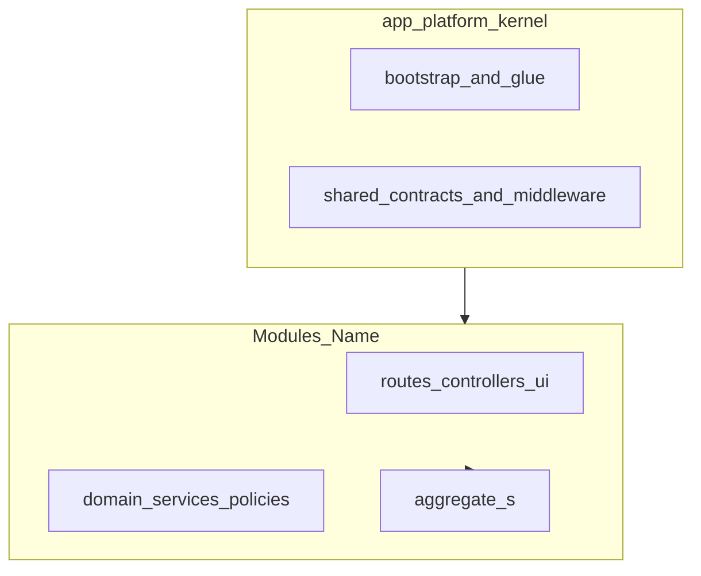

# ADR-0003: Modular monolith — module boundaries (documented hybrid)

Status: **Draft**  
Date: 2026-03-28  
Owner: KSS Steward - YH

---

## 1. Context

This application uses **nWidart/laravel-modules** (`nwidart/laravel-modules` in `composer.json`, with `Modules/*/composer.json` merged via Composer) to structure a **modular monolith**: feature areas are packaged as first-class modules under `Modules/<Name>/`, each with its own routes, providers, and domain code.

A common planning mistake is to think only in terms of **DDD aggregates** (“what is the next aggregate?”). For a **reusable multi-tenant boilerplate**, the more durable question is:

> **What is the next reusable module-level capability?**

Examples of module-level capabilities include tenant settings, billing, notifications, file attachments, search, or tagging. Each capability may contain **one or more aggregates**; the **module** is the primary **delivery and packaging unit**, not the aggregate alone.

The **Workspaces** module is the **validated reference slice** for tenant-facing module implementation in this codebase: module-owned routes and controllers, tenant database migrations, RBAC wiring, web and API surfaces, audit integration, and isolation tests. What was proven is the **module implementation pattern** for tenant-owned functionality—not only a single aggregate.

This ADR records a **documented hybrid**: a **platform kernel** in `app/` and **construction blocks** in `Modules/`. It aligns roadmap work (including **Phase 3E**) with **capability-first** delivery: add a new reusable module slice when it adds a **platform capability**, or defer until that need is real (Option A vs Option B framing below).

---

## 2. Options Considered

### Option A: Strict “everything in Modules/”

**Description:** Move even shared kernel pieces into modules or packages; minimize `app/` to a thin shell.

**Pros:** Uniform packaging; strong boundary.  
**Cons:** In Laravel modular monoliths this often becomes artificial; framework bootstrap, global middleware, and cross-cutting contracts fit naturally in `app/`.

**Not selected** as a strict rule.

### Option B: Documented hybrid — kernel in `app/`, features in `Modules/` ✓ Selected

**Description:** Treat **`app/`** as the **platform kernel** (bootstrap, shared abstractions, base controller, shared middleware, shared contracts, cross-cutting glue). Treat **`Modules/<Name>/`** as the **primary construction block** for tenant-facing and business features. **Aggregates** are **domain units implemented inside** a module.

**Pros:** Realistic for Laravel; clear split between “platform spine” and “feature modules”; matches nWidart usage in this repo.  
**Cons:** Requires discipline so `app/` does not accumulate feature code; legacy code may need phased cleanup.

---

## 3. Decision

### Hierarchy (canonical mental model)

1. **Platform kernel (`app/`)** — Bootstrap, shared abstractions, base controller (`App\Http\Controllers\Controller`), shared middleware, shared contracts/interfaces, cross-cutting support utilities, global listeners/events where truly cross-cutting, framework integration glue.

2. **Module (`Modules/<Name>/`)** — The primary **construction block** for expanding the platform. A module may contain one aggregate or several closely related aggregates. It owns routes, controllers, form requests, services/actions, policies, module-local models, and module-local UI/pages as appropriate.

3. **Aggregate** — A **domain concept** living **inside** a module. **Module = bounded feature / delivery block.** **Aggregate = domain unit inside that block.**

### Rules

- **`app/`** may host **shared kernel and cross-cutting platform code only**; it **must not** become a second feature surface. New tenant-facing or business behavior **must not** be introduced by default under `app/Http/Controllers` or scattered through root route files.

- Root **`routes/web.php`** remains **bootstrap-only** (e.g. minimal redirect / entry behavior) and **must not** become the default location for new tenant-facing business routes. Functional routes belong in **module route files** (see comment block in `routes/web.php`).

- **Phase 3E** is framed in **capability-first** terms: **Option A** — add another reusable **module slice** when it adds a **new platform capability**; **Option B** — defer Phase 3E until a concrete reusable module need exists. It is **not** framed as “add another aggregate” in isolation.

- **Workspaces** remains the **validated reference slice** for how tenant-facing modules are implemented in this project (routes, services, migrations, RBAC, API, audit, tests).

---

## 4. Consequences

### Positive

- Roadmap and backlog questions align with **reusable platform expansion** (“next module capability?”) rather than only low-level domain trivia.
- New contributors can orient quickly: **kernel vs module vs aggregate**.
- nWidart module boundaries stay the default place for **tenant-facing** and **business** surfaces.

### Tradeoffs

- **Discipline required:** without reviews, `app/` can still grow feature controllers or ad-hoc routes; **§5** and a future **`MODULE-BOUNDARY`** enforcement sync (see §6) mitigate drift.
- **Legacy code:** some historical controllers or routes may still live under `app/` or root routes; migrating them is **out of scope** for this ADR and may be tracked as separate work.

---

## 5. Risks & Controls

| Risk | Control |
|------|---------|
| Feature code creeps into `app/` or root routes | Code review; prefer module routes/controllers; optional **`MODULE-BOUNDARY`** lock in PROJECT_MANIFEST after human approval (§6) |
| Confusion between module and aggregate | Use this ADR and module README patterns; name modules by **capability** where possible |
| Phase 3E scoped as “new aggregate” only | Re-read §3 — prioritize **module-level capability** |

---

## 6. Enforcement Impact (for KSS sync only)

This ADR does **not** automatically change enforcement files. If **Status** becomes **Final** and humans approve sync, the following **proposal** applies.

**Lock name (canonical):** **`MODULE-BOUNDARY`** (use this label only—no alternate display name).

**Enforceable constraints to mirror** (e.g. into `PROJECT_MANIFEST.md` / `INTEGRITY_RULES.md`):

- **`Modules/`** are the primary construction blocks for **new** tenant-facing and business capabilities.
- **`app/`** is reserved for shared kernel and cross-cutting platform infrastructure; **not** for new feature surfaces by default.
- Root **`routes/web.php`** stays **bootstrap-only**; new tenant-facing business routes are registered from **module** route files unless explicitly exempted.
- Exceptions require **explicit human approval** and documentation.

**Verification:** Cross-check with `routes/web.php` header comment; module route files under `Modules/*/routes/`.

---

## 7. References

- `composer.json` — `nwidart/laravel-modules`, Composer merge-plugin for `Modules/*/composer.json`
- `config/modules.php` — nWidart module configuration
- `routes/web.php` — bootstrap-only root web routes (comment block)
- `Modules/Workspaces/` — validated reference slice for tenant-facing module pattern
- ADR-0001 — tenancy approach (stancl)
- ADR-0002 — tenant RBAC provisioning (related platform discipline)
- `kss-framework/rules/module-creation-gate.mdc` — **MODULE-CREATION-GATE** (operational; existing module vs `app/` kernel vs new module); enforced in `/gw-triage` workflow

### Diagram (reference)

