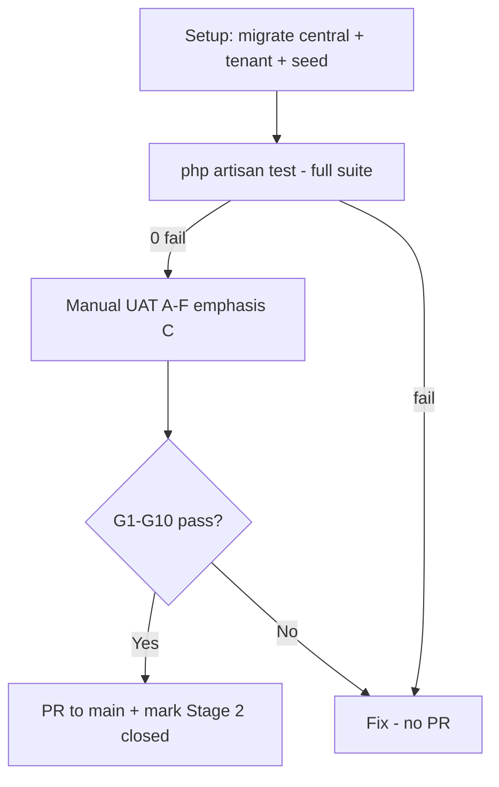

# UAT — JABAL Core Realignment Stages 1 + 2 + 2.5

**Purpose:** Confirm Stage 1 (stabilization), Stage 2 (platform/tenant logical separation), and **Stage 2.5** (runtime session isolation) before PR/merge to `main`.  
**Branch:** `feature/platform-tenant-separation`  
**Stage 2 closure rule:** Stage 2 is **not** closed until this UAT passes in full (including **Suite C** after 2.5).

**Out of scope:** Stage 4+ identity cutover, Stage 5 provisioning, MFA/SSO/billing (Stage 6+), uncommitted MFA work in working tree.

**References:**

- [JABAL_CORE_REALIGNMENT.md](JABAL_CORE_REALIGNMENT.md)
- [TEST_STABILIZATION_GATE.md](TEST_STABILIZATION_GATE.md) — Stage 1
- [PLATFORM_TENANT_SEPARATION_REPORT.md](PLATFORM_TENANT_SEPARATION_REPORT.md) — Stage 2
- [ADR-0007 §3.1.3.1](../architecture/ADR/ADR-0007-platform-tenant-application-separation.md) — runtime session authority
- Plan: `.cursor/plans/runtime_separation_hardening_0f915962.plan.md`

---

## 1. UAT exit criteria (merge gate)


| #   | Criterion                                                                                                                           | Pass? |
| --- | ----------------------------------------------------------------------------------------------------------------------------------- | ----- |
| G1  | Full automated suite: **0 failures** (record count; Stage 1 baseline was **93**; **105** after Stage 2.5 — see §3.1)                | ☑     |
| G2  | Platform operator can use `/platform/`* only (not tenant app)                                                                       | ☑     |
| G3  | Tenant user can register/login and use `/t/{tenant}/*` only                                                                         | ☑     |
| G4  | Cross-context access blocked (platform ↔ tenant routes/guards)                                                                      | ☑     |
| G5  | **Runtime session isolation** (Suite C + G): distinct cookies; platform sessions on central only; tenant sessions on tenant DB only | ☑     |
| G6  | API auth contract: 401 vs 403 behaves as documented                                                                                 | ☑     |
| G7  | Tenant RBAC enforced (role + membership)                                                                                            | ☑     |
| G8  | Legacy `/admin/`* redirects to platform routes                                                                                      | ☑     |
| G9  | `ConfigureApplicationRuntime` is sole web session authority (not global `SESSION_CONNECTION` on platform web)                       | ☑     |
| G10 | Logout in one runtime does **not** clear the other runtime’s session                                                                | ☑     |
| G11 | No MFA/SSO features tested (not in Stage 1–2.5 scope)                                                                               | ☑     |


**UAT result:** ☑ PASS → eligible for PR | ☐ FAIL → fix before PR

**Evidence:** Manual results transcribed from `UAT1.csv` (owner UAT workbook). G5/G9/C9: manual SQL for C9 not recorded; automated `RuntimeSessionIsolationTest` corroboration **pass** (see §4).

After **G1–G10** pass, mark **Stage 2 closed** in [JABAL_CORE_REALIGNMENT.md](JABAL_CORE_REALIGNMENT.md) (Stage 1 already closed).

---

## 2. Environment setup (preconditions)

### 2.1 Branch and clean state

```bash
git branch --show-current   # must be: feature/platform-tenant-separation
git status -s               # MFA artifacts should NOT be staged (Stage 6 scope)
```

### 2.2 Database (fresh UAT recommended)

PostgreSQL with **two** databases:


| DB                    | Purpose                                                                                 |
| --------------------- | --------------------------------------------------------------------------------------- |
| `jabal_central`       | `platform_users`, `platform_sessions`, tenants registry, domains, `tenant_users` bridge |
| `jabal_tenant_shared` | Tenant application `users`, `sessions`, Spatie RBAC, workspaces                         |


From `[.env.example](../../.env.example)` (minimum):

```env
DB_CONNECTION=central
DB_DATABASE_CENTRAL=jabal_central
DB_DATABASE_TENANT=jabal_tenant_shared
TENANCY_MODE=shared_db
APP_URL=http://localhost:8000

APP_ADMIN_EMAIL=admin@jabal.test
APP_ADMIN_NAME="Platform Admin"
APP_ADMIN_PASSWORD=password

SESSION_DRIVER=database
SESSION_CONNECTION=tenant
PLATFORM_SESSION_COOKIE=jabal_platform_session
TENANT_SESSION_COOKIE=jabal_tenant_session
```

> **Note:** `SESSION_CONNECTION` is CLI/PHPUnit fallback only. Platform **web** must use `central` + `platform_sessions` via `ConfigureApplicationRuntime` (ADR §3.1.3.1).

### 2.3 Bootstrap commands

`php artisan migrate:fresh` runs **central only**. Tenant schema is a **second** step.

```bash
composer install
cp .env.example .env          # if needed
php artisan key:generate

# Central (platform) schema
php artisan migrate:fresh

# Tenant application schema (required)
php artisan migrate --path=database/migrations/tenant --database=tenant

php artisan db:seed           # PlatformAdminSeeder + RBAC catalog + settings
php artisan serve             # or XAMPP/vhost
```

**Expected after seed:** One row in `jabal_central.platform_users` (`APP_ADMIN_EMAIL`) — **not** a tenant application user.

---

## 3. Automated regression gate (Stage 1 + 2.5 — run first)

Run before manual UAT. Stage 1 gate plus Stage 2.5 isolation tests.

```bash
php artisan test --filter=RuntimeSessionIsolationTest
php artisan test --filter=PlatformTenantIsolationTest
php artisan test --filter=TenancySecurityTest
php artisan test --filter=TokenTest
php artisan test --filter=RbacTenancyTest
php artisan test --filter="AuthTest|UserAuthTest"
php artisan test
```


| Check                         | Expected                                  | Pass? |
| ----------------------------- | ----------------------------------------- | ----- |
| `RuntimeSessionIsolationTest` | 6 passed                                  | ☑     |
| `PlatformTenantIsolationTest` | 9 passed                                  | ☑     |
| `TenancySecurityTest`         | 12 passed                                 | ☑     |
| `TokenTest`                   | 6 passed                                  | ☑     |
| `RbacTenancyTest`             | **6 passed** (post-fix; UAT1.csv)         | ☑     |
| `AuthTest` + `UserAuthTest`   | 8 passed                                  | ☑     |
| Full suite                    | **0 failed** (~105 tests as of Stage 2.5) | ☑     |


### 3.1 Recorded run (2026-05-27, branch `feature/platform-tenant-separation`)


| Filter / suite                            | Result                           | Notes                                                           |
| ----------------------------------------- | -------------------------------- | --------------------------------------------------------------- |
| `RuntimeSessionIsolationTest`             | **6 passed**                     | Stage 2.5 session isolation                                     |
| `PlatformTenantIsolationTest`             | **9 passed**                     |                                                                 |
| `TenancySecurityTest`                     | **12 passed**                    | API 401/403 contract                                            |
| `TokenTest`                               | **6 passed**                     |                                                                 |
| `AuthTest|UserAuthTest`                   | **8 passed**                     |                                                                 |
| `RbacTenancyTest`                         | **4 passed, 2 failed** → fixed   | Cross-tenant `/api/v1/me` returned 401 (tenancy before Sanctum) |
| `TenantMemberManagementTest`              | **2 passed, 2 failed** → fixed   | Route `{tenant}` bound before `{user}` on suspend               |
| **Full `php artisan test`** (initial)     | **101 passed, 4 failed**         | **G1 blocked**                                                  |
| **Full `php artisan test`** (after fixes) | **105 passed, 0 failed** (~328s) | **G1 pass**                                                     |


**Fixes applied (same branch):** `TenantMemberController` route param `string $tenant` before `User $user`; `BelongsToTenant` allows bearer tokenable when tenancy inits before Sanctum; middleware priority `Authenticate` before `InitializeTenancyByRequestData`.

Save log for evidence:

```bash
php artisan test 2>&1 | tee storage/logs/uat-stage-1-2-2.5-$(date +%Y%m%d).log
```

> PHPUnit uses `jabal_central_testing` / `jabal_tenant_shared_testing` from `phpunit.xml` — do **not** point tests at production dev DBs. See [TEST_DB_ISOLATION_INCIDENT.md](TEST_DB_ISOLATION_INCIDENT.md).

---

## 4. Manual UAT

Use **two browsers or profiles** (Platform vs Tenant) to avoid session bleed.

### Suite A — Platform Management App (Stage 2)


| ID  | Scenario               | Steps                                          | Expected                                             | Pass? | Notes |
| --- | ---------------------- | ---------------------------------------------- | ---------------------------------------------------- | ----- | ----- |
| A1  | Platform login page    | Open `/platform/login`                         | 200, platform login UI                               | ☑     | |
| A2  | Platform login success | Login `APP_ADMIN_EMAIL` / `APP_ADMIN_PASSWORD` | Redirect to `/platform/settings`; `platform` guard   | ☑     | |
| A3  | Platform settings      | Open `/platform/settings`                      | 200                                                  | ☑     | Initial exception on settings page; **fixed and retested OK** |
| A4  | Platform audit         | Open `/platform/audit`                         | 200                                                  | ☑     | |
| A5  | Platform logout        | Logout from platform                           | Redirect to platform login; platform session cleared | ☑     | No logout button/link in UI; verified via console |
| A6  | Legacy admin redirect  | Open `/admin/settings`                         | Redirect to `/platform/settings`                     | ☑     | |
| A7  | Legacy audit redirect  | Open `/admin/audit`                            | Redirect to `/platform/audit`                        | ☑     | |


### Suite B — Tenant Application (web) (Stage 2)


| ID  | Scenario                | Steps                                                     | Expected                                       | Pass? | Notes |
| --- | ----------------------- | --------------------------------------------------------- | ---------------------------------------------- | ----- | ----- |
| B1  | Tenant registration     | Open `/register`; create user                             | Authenticated; redirect `/t/{uuid}/dashboard`  | ☑     | e.g. `/t/a1e24428-9c31-4ebc-8db3-a16c61e72160/dashboard` |
| B2  | Tenant dashboard        | After register                                            | 200; URL `/t/{tenant-id}/dashboard`            | ☑     | |
| B3  | Tenant login            | Logout; login at `/login`                                 | Redirect to personal tenant dashboard          | ☑     | |
| B4  | Root redirect           | Visit `/` as tenant user                                  | Redirect to `/t/{personalTenant}/dashboard`    | ☑     | |
| B5  | Tenant settings         | As tenant-admin, `/t/{tenant}/settings`                   | 200                                            | ☑     | |
| B6  | Tenant members          | `/t/{tenant}/members`                                     | 200 with `member.view`                         | ☑     | |
| B7  | Cross-tenant URL tamper | User A logged in; open User B tenant UUID (hard navigate) | **403** (verify via Network if URL snaps back) | ☑     | |
| B8  | Invalid login           | Wrong password at `/login`                                | Guest; error shown                             | ☑     | |


### Suite C — Platform ↔ Tenant isolation (Stage 2 + **2.5 critical**)

#### B7 verification note (when URL appears to revert)

If editing the address bar seems to "snap back" to the previous URL after Enter, treat B7 as a
**status-code check**, not a visual URL-only check:

1. In User A browser, open DevTools -> **Network** and enable **Preserve log**.
2. Navigate directly to `http://localhost:8000/t/{tenantB}/dashboard`.
3. Confirm the request for `/t/{tenantB}/dashboard` returns **403**.
4. Optional corroboration from terminal:

```bash
php artisan test --filter=TenancySecurityTest --filter=web_route_param_mismatch_returns_403
```

Pass B7 when the attempted cross-tenant request is **403**, even if the UI then returns to User A's last valid tenant page.

Previously **failed** pre–2.5 (shared session store). Re-run after runtime hardening.


| ID  | Scenario                         | Steps                                                                                | Expected                                                                                           | Pass? | Notes |
| --- | -------------------------------- | ------------------------------------------------------------------------------------ | -------------------------------------------------------------------------------------------------- | ----- | ----- |
| C1  | Platform user → tenant dashboard | Platform admin logged in; open `/t/{any}/dashboard`                                  | **Access denied**: **403** or `302 -> /login` (platform guard not valid for tenant web routes)     | ☑     | |
| C2  | Tenant user → platform settings  | Tenant logged in; open `/platform/settings`                                          | Redirect to tenant `/login` (not platform admin)                                                   | ☑     | |
| C3  | Tenant session → platform login  | Tenant session active; open `/platform/login`                                        | Platform guest; no tenant user as platform admin                                                   | ☑     | |
| C4  | Distinct session cookies         | DevTools → Application → Cookies after both logins (separate profiles or sequential) | `jabal_platform_session` and `jabal_tenant_session` both present when both logged in; names differ | ☑     | |
| C5  | Platform logout isolation        | Logged into **both** (two profiles); logout platform only                            | Tenant profile still authenticated on `/t/{tenant}/dashboard`                                      | ☑     | |
| C6  | Tenant logout isolation          | Logged into **both**; logout tenant only                                             | Platform profile still on `/platform/settings`                                                     | ☑     | Intermittent **419** on `/logout` when both runtimes share one browser profile; use separate profiles or hard-refresh before tenant logout. Isolation outcome **pass**. |
| C7  | Central session storage          | After platform login only: query `jabal_central.platform_sessions`                   | ≥1 row; payload for platform user                                                                  | ☑     | |
| C8  | Tenant session storage           | After tenant login only: query `jabal_tenant_shared.sessions`                        | ≥1 row; **no** platform admin rows from C7-only login                                              | ☑     | |
| C9  | No platform session on tenant DB | After platform login only                                                            | `jabal_tenant_shared.sessions` empty or no platform-user session                                   | ☑     | Manual SQL not recorded in UAT1.csv; **automated test corroboration pass** (see table below) |


**Automated test references (repo paths):**

| UAT | Test file | Test method | Pass? |
|-----|-----------|-------------|-------|
| B7 | [`tests/Feature/TenancySecurityTest.php`](../../tests/Feature/TenancySecurityTest.php) | `test_web_route_param_mismatch_returns_403` | ☑ |
| C1 | [`tests/Feature/PlatformTenantIsolationTest.php`](../../tests/Feature/PlatformTenantIsolationTest.php) | `test_platform_user_cannot_access_tenant_dashboard_without_membership` | ☑ |
| C2 | [`tests/Feature/PlatformTenantIsolationTest.php`](../../tests/Feature/PlatformTenantIsolationTest.php) | `test_tenant_user_cannot_access_platform_settings` | ☑ |
| C3 | [`tests/Feature/PlatformTenantIsolationTest.php`](../../tests/Feature/PlatformTenantIsolationTest.php) | `test_authenticated_platform_user_visiting_platform_login_redirects_to_settings` (inverse: tenant on `/platform/login` = guest UI manually) | ☑ |
| C4 | [`tests/Feature/RuntimeSessionIsolationTest.php`](../../tests/Feature/RuntimeSessionIsolationTest.php) | `test_platform_and_tenant_session_cookies_are_distinct` | ☑ |
| C7 | [`tests/Feature/RuntimeSessionIsolationTest.php`](../../tests/Feature/RuntimeSessionIsolationTest.php) | `test_platform_login_persists_session_in_central_platform_sessions_only` | ☑ |
| C8 | [`tests/Feature/RuntimeSessionIsolationTest.php`](../../tests/Feature/RuntimeSessionIsolationTest.php) | `test_tenant_login_route_resolves_session_connection_to_tenant` (+ manual SQL on `sessions`) | ☑ |
| C9 | [`tests/Feature/RuntimeSessionIsolationTest.php`](../../tests/Feature/RuntimeSessionIsolationTest.php) | `test_platform_login_persists_session_in_central_platform_sessions_only` (asserts tenant `sessions` has no platform-user rows) | ☑ |

**Run examples:**

```bash
php artisan test --filter=RuntimeSessionIsolationTest
php artisan test --filter=PlatformTenantIsolationTest
php artisan test --filter=TenancySecurityTest::test_web_route_param_mismatch_returns_403
```

**Example SQL (psql):**

```sql
-- After platform login (C7)
SELECT id, user_id, last_activity FROM platform_sessions;

-- After tenant login (C8) — tenant DB
SELECT id, user_id, last_activity FROM sessions;
```

### Suite D — API auth contract (Stage 1 + 2)

Base URL: `{APP_URL}/api/v1`


| ID  | Scenario           | Request                                              | Expected HTTP                              | Pass? |
| --- | ------------------ | ---------------------------------------------------- | ------------------------------------------ | ----- |
| D1  | Health (public)    | `GET /api/v1/health`                                 | **200**                                    | ☑     |
| D2  | Token mint         | `POST /api/v1/auth/token` with tenant email/password | **200** + bearer + `tenant:{uuid}` ability | ☑     |
| D3  | No auth            | `GET /api/v1/me` without token                       | **401**                                    | ☑     |
| D4  | No tenant header   | Valid token, no `X-Tenant-Id`                        | **401**                                    | ☑     |
| D5  | Header mismatch    | Token Tenant A, `X-Tenant-Id` Tenant B               | **403** (not 401)                          | ☑     |
| D6  | Valid access       | Matching token + header + membership                 | **200** on `/api/v1/me`                    | ☑     |
| D7  | Wrong tenant token | Token for tenant user not member of                  | **403** at token creation                  | ☑     |
| D8  | Revoke token       | `DELETE /api/v1/auth/token`                          | **200/204**; then **401**                  | ☑     |


**Example (D2 + D6):**

```bash
curl -s -X POST http://localhost:8000/api/v1/auth/token \
  -H "Content-Type: application/json" \
  -d '{"email":"YOUR_TENANT_EMAIL","password":"YOUR_PASSWORD"}'

curl -s http://localhost:8000/api/v1/me \
  -H "Authorization: Bearer YOUR_TOKEN" \
  -H "X-Tenant-Id: YOUR_TENANT_UUID"
```

### Suite E — Tenant RBAC (Stage 2)


| ID  | Scenario                                      | Expected            | Pass? |
| --- | --------------------------------------------- | ------------------- | ----- |
| E1  | Owner/admin PATCH tenant settings             | **200**             | ☑     |
| E2  | Member without `settings.update` cannot PATCH | **403**             | ☑     |
| E3  | Role in Tenant A does not grant Tenant B      | **403** on Tenant B | ☑     |
| E4  | Suspended membership denies access            | **403**             | ☑     |


*Automated:* `RbacTenancyTest`, `TenantSettingsTest`, `TenantMemberManagementTest`.

### Suite F — Tenancy abstraction (Stage 3 design — smoke only)


| ID  | Check                               | Expected                                                        | Pass? |
| --- | ----------------------------------- | --------------------------------------------------------------- | ----- |
| F1  | `.env` has `TENANCY_MODE=shared_db` | Present                                                         | ☑     |
| F2  | Tenant users on tenant connection   | `jabal_tenant_shared.users` has `tenant_id`                     | ☑     |
| F3  | Platform users central only         | `jabal_central.platform_users`; platform admin not tenant login | ☑     |


No UAT for `database_per_tenant` — **Stage 5**.

---

## 5. Known limitations (do not fail UAT)


| Item                                         | Notes                                                     |
| -------------------------------------------- | --------------------------------------------------------- |
| Central legacy `users` rows                  | Stage 4 deep cutover                                      |
| Impersonation redesign                       | Stage 4+                                                  |
| MFA / SSO / step-up                          | Stage 6+; exclude from this UAT                           |
| Platform RBAC tables                         | Defined ADR §3.1.5; **tables** Stage 4                    |
| ADR-0007 status                              | Lock Active; ADR may remain Draft until owner promotes    |
| Pre-existing test failures                   | Resolved — **105 passed / 0 failed** at UAT (see §3)      |
| Web edge: `tenant_users` without `users` row | TEST_STABILIZATION_GATE Bucket 1                          |
| Platform settings page exception (A3)        | **Fixed during UAT**; retest pass                         |
| Platform logout UI (A5)                      | No button/link in UI; session cleared via console — UX follow-up |
| Tenant logout 419 (C6)                       | Intermittent when one browser profile hosts both cookies; use separate profiles — not a session-isolation failure |
| C9 manual SQL                                | Not recorded in UAT1.csv; automated `RuntimeSessionIsolationTest` pass used as corroboration |


---

## 6. Sign-off record


| Field               | Value                                     |
| ------------------- | ----------------------------------------- |
| **UAT date**        | 2026-05-28 (transcribed from UAT1.csv)    |
| **Tester**          | Owner (UAT1.csv)                          |
| **Branch / commit** | `feature/platform-tenant-separation` @ `ed7decb` |
| **Environment**     | local (`http://localhost:8000`)           |
| **Automated suite** | **105 passed / 0 failed** (sign-off run); **106 passed / 0 failed** on later verification run |
| **Manual A–F**      | **38 / 38** passed (C9 corroborated by automated test) |
| **Suite C (2.5)**   | ☑ Pass ☐ Fail                             |
| **Blockers found**  | None for merge; UX follow-ups in §5       |
| **Decision**        | ☑ APPROVED for PR → `main` ☐ NOT APPROVED |


**Approver:** Owner **Date:** 2026-05-28

**External evidence:** `UAT1.csv` (owner workbook, not in repo).

---

## 7. Suggested execution order




1. **Automated gate** (Section 3) — Stage 1 regression + Stage 2.5 tests
2. **Suite C** (Section 4) — highest risk; was blocked pre–2.5
3. Platform + tenant happy paths (A, B)
4. API contract (D) and RBAC (E)
5. Sign-off → PR

---

## 8. What this UAT proves


| Stage         | What UAT confirms                                                                                                             |
| ------------- | ----------------------------------------------------------------------------------------------------------------------------- |
| **Stage 1**   | Suite green; API 401/403 contract; middleware order; stabilization gate                                                       |
| **Stage 2**   | `PlatformUser` vs `TenantUser`; guards/routes; registration; RBAC on tenant DB; route isolation                               |
| **Stage 2.5** | `platform_sessions` on central; tenant `sessions` on tenant DB; distinct cookies; `ConfigureApplicationRuntime`; Suite C pass |


Stage 3 remains design-only (Suite F smoke). Stages 4–6 are post-merge.